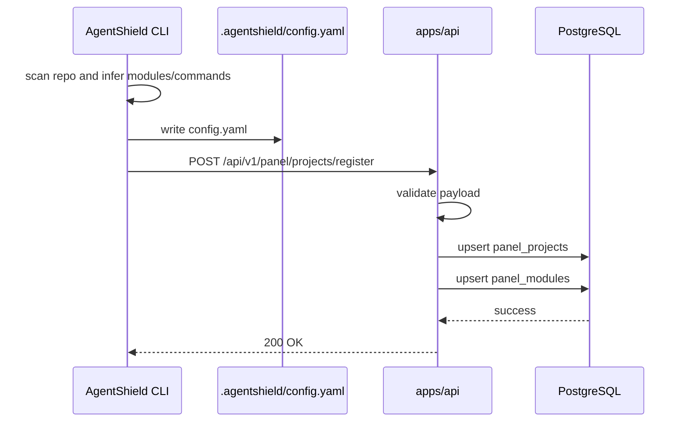
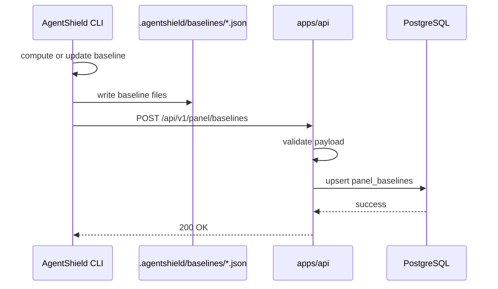
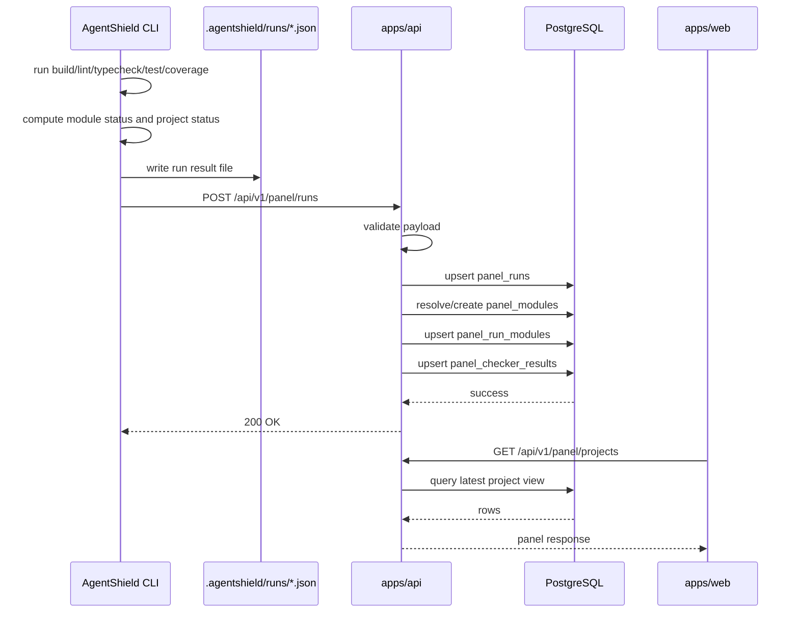

# AgentShield Week 1 Panel — Detailed Technical Solution

> Version: v3.0
> Date: 2026-03-30
> Scope: Week 1 Panel

## 1. Goals

The Week 1 Panel uses a "CLI writes to API, API writes to DB, Web reads from API" design.

This document focuses on 6 questions:

1. what `Project`, `Module`, `Run`, `Checker Result`, and `Baseline` mean
2. what the 6 tables `panel_projects`, `panel_runs`, `panel_modules`, `panel_run_modules`, `panel_checker_results`, and `panel_baselines` store
3. which API the CLI calls and at what time
4. which API is used for project initialization data, baseline data, and each check result
5. how request payloads map into DB fields
6. how Web query endpoints are designed

## 2. Overall Architecture

```text
agentshield init / baseline update / check
  ↓
CLI writes local .agentshield/* files
  ↓
CLI calls apps/api write endpoints
  + POST /api/v1/panel/projects/register
  + POST /api/v1/panel/baselines
  + POST /api/v1/panel/runs
  ↓
apps/api validates payloads and writes PostgreSQL
  ↓
apps/web calls apps/api read endpoints
  ↓
Panel renders project overview and detail
```

Clear boundary:

- `.agentshield/*` still exists as CLI local artifacts
- the Panel does not read the filesystem directly
- `apps/api` is the only DB write entry
- `apps/web` reads only through API endpoints

## 3. Core Concepts

### 3.1 Project

A `Project` is a repository managed by AgentShield.

Examples:

- `infer-monorepo`
- `agentpay-sdk-internal`
- `ab-monorepo`

Project-level data:

- project name
- repository path
- preset
- onboarding status
- latest run status
- latest blocking reason

### 3.2 Module

A `Module` is a sub-module inside a Project that the CLI identified and ran checks against.

Examples:

- `apps/api`
- `apps/web`
- `mobile-app`

Module-level data:

- module name
- stack
- stable module metadata
- latest run snapshot data
- current effective baseline

### 3.3 Run

A `Run` is one complete `agentshield check` execution.

Important points:

- Run is project-level
- one Run contains results for multiple Modules
- one Run has one project-level final status

### 3.4 Checker Result

A `Checker Result` is the result of one checker for one Module in one Run.

Fixed checkers:

- `build`
- `lint`
- `typecheck`
- `test`
- `coverage`

### 3.5 Baseline

A `Baseline` is the currently effective coverage baseline for one Module.

Important points:

- Baseline is not run history
- Baseline is the threshold reference for the module
- `baseline update` changes the Baseline

## 4. Database Tables And Relationships

### 4.1 Relationship overview

```text
Project 1 --- N Run
Project 1 --- N Module
Project 1 --- N Baseline

Run 1 --- N RunModule
Module 1 --- N RunModule
RunModule 1 --- N CheckerResult
Module 1 --- 1 Baseline
```

### 4.2 One-line explanation of the 6 tables

- `panel_projects`: project master table, stores project static info and onboarding state
- `panel_runs`: project run history table, stores project-level results for each check
- `panel_modules`: module master table, stores stable module identity and metadata
- `panel_run_modules`: run-module snapshot table, stores module status, coverage, and gate values for one run
- `panel_checker_results`: run detail table, stores build/lint/typecheck/test/coverage results for one run module in one run
- `panel_baselines`: module baseline table, stores the current effective baseline

## 5. Table Design

## 5.1 `panel_projects`

Purpose:

- one row represents one Project

Fields:

| Field | Type | Meaning |
|---|---|---|
| `id` | integer PK | primary key |
| `project_key` | text unique | unique project identifier, recommended from `project.name` |
| `project_name` | text | display name |
| `repo_path` | text | repository path |
| `preset` | text | CLI-resolved preset |
| `onboarding_status` | text | `ready / pending / blocked / custom-needed` |
| `commands_json` | text nullable | command config confirmed during initialization |
| `thresholds_json` | text nullable | coverage/lint/typecheck threshold config |
| `timeouts_json` | text nullable | timeout config |
| `notify_json` | text nullable | notification config |
| `created_at` | datetime | creation time |
| `updated_at` | datetime | last update time |

Unique key:

- `project_key`

This table answers:

- what the project is
- whether onboarding is complete
- what the current config looks like

## 5.2 `panel_runs`

Purpose:

- one row represents one complete project-level check execution

Fields:

| Field | Type | Meaning |
|---|---|---|
| `id` | integer PK | primary key |
| `project_id` | integer FK | references `panel_projects.id` |
| `run_key` | text unique | unique run key, recommended `project + git_sha + started_at + source` |
| `source` | text nullable | source such as `local-cli`, `github-actions` |
| `git_ref` | text nullable | branch or tag |
| `git_sha` | text nullable | commit SHA |
| `triggered_by` | text nullable | trigger user or system |
| `started_at` | datetime nullable | start time |
| `finished_at` | datetime nullable | finish time |
| `duration_sec` | real nullable | total duration |
| `strict_mode` | boolean | whether `--strict` was enabled |
| `status` | text | project-level result: `pass / fail / timeout / blocked / not-run` |
| `block_reason` | text nullable | project-level blocking reason |
| `created_at` | datetime | write time |

Unique key:

- `run_key`

This table answers:

- when a given check ran
- who triggered it
- what the final project-level result was

## 5.3 `panel_modules`

Purpose:

- one row represents one stable Module under one Project

Fields:

| Field | Type | Meaning |
|---|---|---|
| `id` | bigint PK | primary key |
| `project_id` | bigint FK | references `panel_projects.id` |
| `module_name` | text | module name, e.g. `apps/api` |
| `stack` | text nullable | stack text such as `Python / FastAPI` |
| `language` | text nullable | primary language or tag |
| `created_at` | timestamptz | creation time |
| `updated_at` | timestamptz | last sync time |

Unique key:

- `(project_id, module_name)`

This table answers:

- which modules exist in the project
- what the stable stack identity of the module is

## 5.4 `panel_run_modules`

Purpose:

- one row represents one module snapshot in one Run

Fields:

| Field | Type | Meaning |
|---|---|---|
| `id` | bigint PK | primary key |
| `run_id` | bigint FK | references `panel_runs.id` |
| `module_id` | bigint FK | references `panel_modules.id` |
| `stack` | text nullable | runtime-reported stack text |
| `language` | text nullable | runtime-reported primary language |
| `status` | text | module result for this run |
| `coverage_pct` | double precision nullable | coverage for this run |
| `baseline_pct` | double precision nullable | baseline echoed in this run |
| `coverage_gate_pct` | double precision nullable | gate threshold for this run |
| `coverage_delta_pct` | double precision nullable | delta vs baseline for this run |
| `coverage_parser` | text nullable | coverage parser |
| `block_reason` | text nullable | module-level blocking reason |
| `created_at` | timestamptz | write time |
| `updated_at` | timestamptz | last update time |

Unique key:

- `(run_id, module_id)`

This table answers:

- whether a module passed or failed in one specific run
- what its coverage/baseline/gate values were in that run

## 5.5 `panel_checker_results`

Purpose:

- one row represents one checker result for one run module in one Run

Fields:

| Field | Type | Meaning |
|---|---|---|
| `id` | bigint PK | primary key |
| `run_id` | bigint FK | references `panel_runs.id` |
| `run_module_id` | bigint FK | references `panel_run_modules.id` |
| `checker` | text | `build / lint / typecheck / test / coverage` |
| `status` | text | `pass / fail / timeout / skip` |
| `detail` | text nullable | checker output summary |
| `duration_sec` | double precision nullable | checker duration |
| `created_at` | timestamptz | write time |

Unique key:

- `(run_module_id, checker)`

This table answers:

- whether lint passed or failed
- what the test output summary was
- whether build and typecheck passed

## 5.6 `panel_baselines`

Purpose:

- one row represents the currently effective baseline for one Module

Fields:

| Field | Type | Meaning |
|---|---|---|
| `id` | bigint PK | primary key |
| `project_id` | bigint FK | references `panel_projects.id` |
| `module_id` | bigint FK | references `panel_modules.id` |
| `baseline_pct` | double precision nullable | current baseline line coverage |
| `updated_at` | timestamptz | baseline last update time |

Unique key:

- `(project_id, module_id)`

This table answers:

- what the current coverage baseline is for this module

## 6. CLI Write API Design

Week 1 needs 3 CLI write API categories:

1. project initialization upload
2. baseline upload
3. per-check run result upload

## 6.1 Project initialization API

Endpoint:

`POST /api/v1/panel/projects/register`

Purpose:

- `agentshield init`
- `agentshield init --yes`
- first-time auto-init inside `agentshield check`

Call timing:

- after CLI finishes project scanning
- after user confirmation or CI auto-accept of modules and commands
- immediately after `.agentshield/config.yaml` is written successfully

Suggested request body:

```json
{
  "project_key": "infer-monorepo",
  "project_name": "infer-monorepo",
  "repo_path": ".",
  "preset": "infer-monorepo",
  "onboarding_status": "ready",
  "commands": {
    "build": "pnpm build",
    "lint": "pnpm lint",
    "typecheck": "pnpm typecheck",
    "test": "pnpm test",
    "coverage": "pnpm test --coverage"
  },
  "thresholds": {
    "coverage_tolerance_pct": 5,
    "coverage_floor_pct": 0,
    "lint_max_errors": 0,
    "typecheck_max_errors": 0
  },
  "timeouts": {
    "build": 300,
    "test": 600
  },
  "notify": {
    "feishu_webhook": "https://..."
  },
  "modules": [
    {
      "module_name": "apps/api",
      "stack": "Python / FastAPI",
      "language": "Python"
    },
    {
      "module_name": "apps/web",
      "stack": "TypeScript / Next.js",
      "language": "TypeScript"
    }
  ]
}
```

Write rules:

- upsert `panel_projects`
- upsert `panel_modules` from `modules[]`

## 6.2 Baseline upload API

Endpoint:

`POST /api/v1/panel/baselines`

Purpose:

- upload baseline after initial baseline collection during init
- upload baseline after `agentshield baseline update`

Call timing:

- after baseline files are written successfully
- after baseline values are finalized
- immediately after local file write succeeds

Suggested request body:

```json
{
  "project_key": "infer-monorepo",
  "updated_at": "2026-03-30T10:00:00Z",
  "modules": [
    {
      "module_name": "apps/api",
      "baseline_pct": 81.0
    },
    {
      "module_name": "apps/web",
      "baseline_pct": 72.0
    }
  ]
}
```

Write rules:

- resolve `panel_projects` by `project_key`
- resolve or create `panel_modules` by `module_name`
- upsert `panel_baselines`
- do not require writing back into `panel_modules`; read paths should use `panel_baselines` as the source of truth

## 6.3 Check result upload API

Endpoint:

`POST /api/v1/panel/runs`

Purpose:

- every `agentshield check`
- every `agentshield check --no-init --strict`

Call timing:

- after all checkers finish
- after coverage gate calculation is complete
- after Reporter has produced final project-level and module-level results
- immediately after the local run result file is written

Suggested request body:

```json
{
  "project_key": "infer-monorepo",
  "run_key": "infer-monorepo_abc123_2026-03-30T10:00:00Z_local-cli",
  "source": "local-cli",
  "git_ref": "main",
  "git_sha": "abc123",
  "triggered_by": "alice",
  "started_at": "2026-03-30T10:00:00Z",
  "finished_at": "2026-03-30T10:00:31Z",
  "duration_sec": 31.2,
  "strict_mode": true,
  "status": "fail",
  "block_reason": "apps/web coverage below gate",
  "modules": [
    {
      "module_name": "apps/api",
      "stack": "Python / FastAPI",
      "language": "Python",
      "status": "pass",
      "coverage_pct": 81.2,
      "baseline_pct": 81.0,
      "coverage_gate_pct": 76.0,
      "coverage_delta_pct": 0.2,
      "coverage_parser": "pytest-cov-json",
      "block_reason": null,
      "checker_results": [
        { "checker": "build", "status": "pass", "detail": "", "duration_sec": 3.2 },
        { "checker": "lint", "status": "pass", "detail": "", "duration_sec": 2.1 },
        { "checker": "typecheck", "status": "pass", "detail": "", "duration_sec": 4.5 },
        { "checker": "test", "status": "pass", "detail": "86 passed / 0 failed", "duration_sec": 10.0 },
        { "checker": "coverage", "status": "pass", "detail": "Line 81.2%, gate >= 76.0%", "duration_sec": 1.0 }
      ]
    },
    {
      "module_name": "apps/web",
      "stack": "TypeScript / Next.js",
      "language": "TypeScript",
      "status": "fail",
      "coverage_pct": 58.3,
      "baseline_pct": 72.0,
      "coverage_gate_pct": 67.0,
      "coverage_delta_pct": -13.7,
      "coverage_parser": "istanbul-json",
      "block_reason": "coverage below gate",
      "checker_results": [
        { "checker": "build", "status": "pass", "detail": "", "duration_sec": 12.3 },
        { "checker": "lint", "status": "pass", "detail": "", "duration_sec": 3.4 },
        { "checker": "typecheck", "status": "pass", "detail": "", "duration_sec": 5.2 },
        { "checker": "test", "status": "pass", "detail": "43 passed / 0 failed", "duration_sec": 8.0 },
        { "checker": "coverage", "status": "fail", "detail": "Line 58.3%, gate >= 67.0%", "duration_sec": 1.3 }
      ]
    }
  ]
}
```

Write rules:

- upsert `panel_runs`
- resolve or create `panel_modules`
- upsert `panel_run_modules`
- upsert `panel_checker_results`
- if `baseline_pct` is included, keep it as a redundant echo field in `panel_run_modules.baseline_pct`

## 7. CLI Call Timing

## 7.1 Init flow

Call order:

1. CLI scans the project
2. CLI writes `.agentshield/config.yaml`
3. CLI calls `POST /api/v1/panel/projects/register`
4. if init also collected baseline, CLI calls `POST /api/v1/panel/baselines`

## 7.2 Baseline update flow

Call order:

1. CLI reads current baseline
2. CLI recalculates and confirms the new baseline
3. CLI writes `.agentshield/baselines/*.json`
4. CLI calls `POST /api/v1/panel/baselines`

## 7.3 Check flow

Call order:

1. CLI loads config
2. CLI runs module checkers concurrently
3. CLI calculates coverage gate
4. CLI aggregates project-level result
5. CLI writes `.agentshield/runs/*.json`
6. CLI calls `POST /api/v1/panel/runs`

## 7.4 Upload failure handling

Week 1 recommendation:

- API upload failure must not block the CLI main flow
- CLI logs a warning
- local file artifacts still succeed
- retry or later backfill can recover the Panel state

Only exception:

- if CI later requires successful Panel upload as a gate, add a dedicated flag for that behavior

## 8. Read API Design

## 8.1 `GET /api/v1/panel/projects`

Purpose:

- Panel homepage project overview

Read logic:

1. read `panel_projects`
2. get the latest `panel_runs` row for each project
3. aggregate `panel_modules`
4. derive `module_count`
5. derive `health`

Suggested response:

```json
{
  "generated_at": "2026-03-30T10:05:00Z",
  "projects": [
    {
      "project_key": "infer-monorepo",
      "project_name": "infer-monorepo",
      "preset": "infer-monorepo",
      "module_count": 2,
      "onboarding_status": "ready",
      "health": "failing",
      "check_all": "fail",
      "last_run_at": "2026-03-30T10:00:31Z",
      "block_reason": "apps/web coverage below gate"
    }
  ]
}
```

## 8.2 `GET /api/v1/panel/projects/{project_key}`

Purpose:

- project detail page

Read logic:

1. query `panel_projects`
2. query all `panel_modules` under the project
3. query the latest `panel_runs` row for the project
4. query all `panel_run_modules` under that run
5. query all `panel_checker_results` under that run
6. query `panel_baselines`

## 8.3 `GET /api/v1/panel/projects/{project_key}/latest`

Purpose:

- latest run detail

Read logic:

1. query the latest `panel_runs` row for the project
2. query all `panel_run_modules` under that run
3. query all `panel_checker_results` under that run
4. query `panel_baselines`

## 9. Field Mapping

## 9.1 Initialization mapping

| CLI field | Target table | Target field |
|---|---|---|
| `project.name` | `panel_projects` | `project_key`, `project_name` |
| `project.repo_path` | `panel_projects` | `repo_path` |
| `project.preset` | `panel_projects` | `preset` |
| `commands` | `panel_projects` | `commands_json` |
| `thresholds` | `panel_projects` | `thresholds_json` |
| `timeouts` | `panel_projects` | `timeouts_json` |
| `notify` | `panel_projects` | `notify_json` |
| module list | `panel_modules` | `module_name`, `stack`, `language` |

## 9.2 Baseline mapping

| CLI field | Target table | Target field |
|---|---|---|
| `project_key` | `panel_projects` | lookup |
| `module_name` | `panel_modules` | lookup |
| `baseline_pct` | `panel_baselines` | `baseline_pct` |
| `updated_at` | `panel_baselines` | `updated_at` |

## 9.3 Run mapping

| CLI field | Target table | Target field |
|---|---|---|
| `run_key` | `panel_runs` | `run_key` |
| `source` | `panel_runs` | `source` |
| `git_ref` | `panel_runs` | `git_ref` |
| `git_sha` | `panel_runs` | `git_sha` |
| `triggered_by` | `panel_runs` | `triggered_by` |
| `started_at` | `panel_runs` | `started_at` |
| `finished_at` | `panel_runs` | `finished_at` |
| `duration_sec` | `panel_runs` | `duration_sec` |
| `strict_mode` | `panel_runs` | `strict_mode` |
| project final status | `panel_runs` | `status` |
| project block reason | `panel_runs` | `block_reason` |

## 9.4 Module result mapping

| CLI field | Target table | Target field |
|---|---|---|
| `module_name` | `panel_modules` | `module_name` |
| `stack` | `panel_run_modules` | `stack` |
| `language` | `panel_run_modules` | `language` |
| module status | `panel_run_modules` | `status` |
| `coverage_pct` | `panel_run_modules` | `coverage_pct` |
| `baseline_pct` | `panel_run_modules` | `baseline_pct` |
| `coverage_gate_pct` | `panel_run_modules` | `coverage_gate_pct` |
| `coverage_delta_pct` | `panel_run_modules` | `coverage_delta_pct` |
| `coverage_parser` | `panel_run_modules` | `coverage_parser` |
| module block reason | `panel_run_modules` | `block_reason` |

## 9.5 Checker result mapping

### build

- `panel_checker_results.checker = build`
- `panel_checker_results.status`
- `panel_checker_results.detail`
- `panel_checker_results.duration_sec`

### lint

- `panel_checker_results.checker = lint`
- `panel_checker_results.status`
- `panel_checker_results.detail`
- `panel_checker_results.duration_sec`

### typecheck

- `panel_checker_results.checker = typecheck`
- `panel_checker_results.status`
- `panel_checker_results.detail`
- `panel_checker_results.duration_sec`

### test

- `panel_checker_results.checker = test`
- `panel_checker_results.status`
- `panel_checker_results.detail`
- `panel_checker_results.duration_sec`

Example detail values:

- `86 passed / 0 failed`
- `43 passed / 0 failed`

### coverage

Coverage status part:

- `panel_checker_results.checker = coverage`
- `panel_checker_results.status`
- `panel_checker_results.detail`
- `panel_checker_results.duration_sec`

Coverage numeric part:

- `panel_run_modules.coverage_pct`
- `panel_run_modules.baseline_pct`
- `panel_run_modules.coverage_gate_pct`
- `panel_run_modules.coverage_delta_pct`
- `panel_run_modules.coverage_parser`
- `panel_run_modules.block_reason`
- `panel_baselines.baseline_pct`

## 10. Status Calculation Rules

## 10.1 Module status

Calculated in order:

1. any checker `fail` -> Module `fail`
2. otherwise any checker `timeout` -> Module `timeout`
3. otherwise coverage gate fails -> Module `fail`
4. otherwise not run -> `blocked` or `not-run`
5. otherwise -> `pass`

## 10.2 Project status

Aggregated from Module states:

1. any Module `fail` -> Project `fail`
2. otherwise any Module `timeout` -> Project `timeout`
3. otherwise any Module `blocked` -> Project `blocked`
4. otherwise all runnable Modules passed -> `pass`
5. otherwise -> `not-run`

## 10.3 Health

| Project `status` | `health` |
|---|---|
| `pass` | `healthy` |
| `fail` | `failing` |
| `timeout` | `warning` |
| `blocked` | `warning` |
| `not-run` | `unknown` |

## 11. Sequence Diagrams

## 11.1 Project initialization



## 11.2 Baseline upload



## 11.3 Check result upload



## 12. Upload Failure Strategy

Week 1 recommendation:

- write API failure must not block the CLI main flow
- CLI logs a warning
- local `.agentshield/*` files must still succeed
- retry or later backfill can restore Panel state

## 13. Final Conclusion

The correct Week 1 Panel design is:

- CLI calls 3 write APIs at 3 moments:
  - after init completes: `POST /api/v1/panel/projects/register`
  - after baseline is created or updated: `POST /api/v1/panel/baselines`
  - after each check completes: `POST /api/v1/panel/runs`
- API is the only DB write entry
- Web reads only through query endpoints
- the 6 tables have clear responsibilities:
  - `panel_projects`: project static info and onboarding status
  - `panel_runs`: project run history
  - `panel_modules`: module master data
  - `panel_run_modules`: per-run module snapshot
  - `panel_checker_results`: fine-grained checker results per run
  - `panel_baselines`: current module baseline
