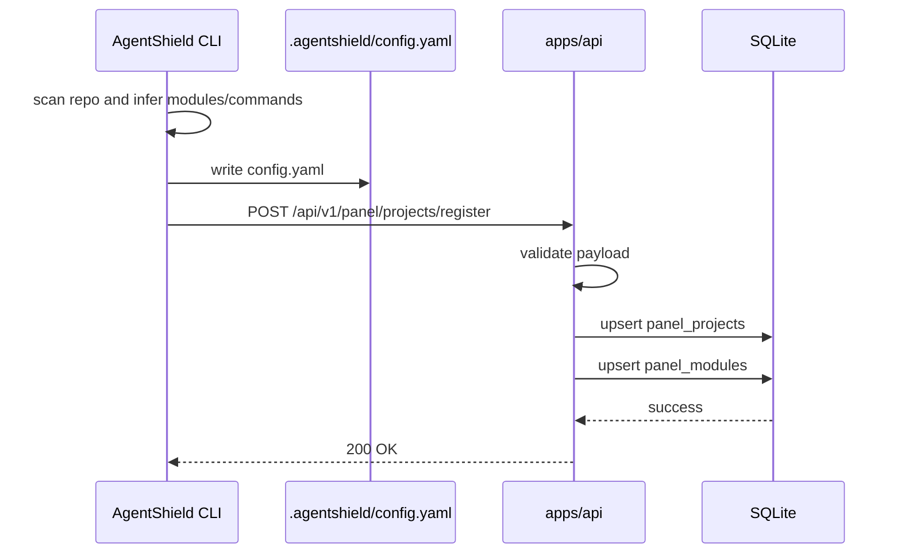
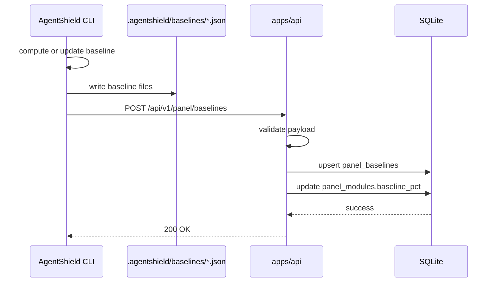
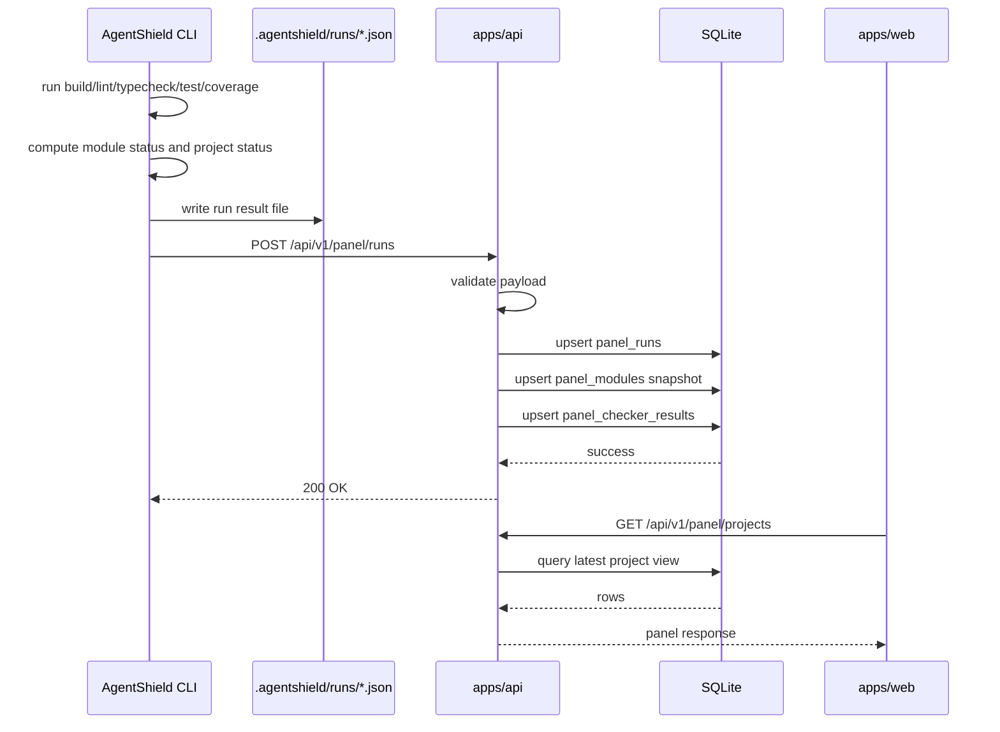

# AgentShield Week 1 Panel 详细技术方案

> 版本：v3.0
> 日期：2026-03-30
> 范围：Week 1 Panel

## 1. 方案目标

Week 1 Panel 采用“CLI 通过 API 直接落库，Web 通过 API 读库”的方案。

这份文档重点解决 6 个问题：

1. `Project`、`Module`、`Run`、`Checker Result`、`Baseline` 分别是什么
2. `panel_projects`、`panel_runs`、`panel_modules`、`panel_checker_results`、`panel_baselines` 5 张表分别存什么
3. CLI 在什么时机调用什么 API
4. 项目初始化信息、baseline、每次 check 结果分别通过什么 API 上传
5. API 请求体和数据库字段如何映射
6. Web 查询接口如何设计

## 2. 总体架构

```text
agentshield init / baseline update / check
  ↓
CLI 生成本地 .agentshield/* 文件
  ↓
CLI 调用 apps/api 写接口
  ↓
apps/api 校验并写入 SQLite
  ↓
apps/web 调用 apps/api 读接口
  ↓
Panel 展示项目总览与详情
```

明确边界：

- `.agentshield/*` 仍然是 CLI 的本地产物
- Panel 不从文件系统直接读数据
- `apps/api` 是唯一落库入口
- `apps/web` 只通过读接口查询

## 3. 核心概念

### 3.1 Project

`Project` 表示一个被 AgentShield 管理的仓库。

例子：

- `infer-monorepo`
- `agentpay-sdk-internal`
- `ab-monorepo`

Project 级信息：

- 项目名
- 仓库路径
- preset
- 接入状态
- 最近一次运行状态
- 最近一次阻塞原因

### 3.2 Module

`Module` 表示一个 Project 下被 CLI 识别并执行检查的子模块。

例子：

- `apps/api`
- `apps/web`
- `mobile-app`

Module 级信息：

- 模块名
- 技术栈
- 当前状态
- 当前 coverage
- 当前 baseline
- 当前 gate
- 当前模块级阻塞原因

### 3.3 Run

`Run` 表示一次完整的 `agentshield check` 执行。

注意：

- Run 是项目级概念
- 一次 Run 包含多个 Module 的执行结果
- Run 有一个项目级最终状态

### 3.4 Checker Result

`Checker Result` 表示某个 Module 在某次 Run 中一个 checker 的结果。

固定 checker：

- `build`
- `lint`
- `typecheck`
- `test`
- `coverage`

### 3.5 Baseline

`Baseline` 表示某个 Module 当前生效的 coverage 基线。

注意：

- Baseline 不是 Run 历史
- Baseline 是模块当前阈值参考
- `baseline update` 会更新 Baseline

## 4. 数据库表与关系

## 4.1 关系总览

```text
Project 1 --- N Run
Project 1 --- N Module
Project 1 --- N Baseline

Run 1 --- N CheckerResult
Module 1 --- N CheckerResult
Module 1 --- 1 Baseline
```

## 4.2 五张表一句话解释

- `panel_projects`：项目主表，存项目静态信息和接入状态
- `panel_runs`：项目运行历史表，存每次 check 的项目级结果
- `panel_modules`：模块当前快照表，存模块当前状态
- `panel_checker_results`：运行明细表，存某次 Run 中某个模块的 build/lint/typecheck/test/coverage 结果
- `panel_baselines`：模块 baseline 表，存模块当前有效 baseline

## 5. 表结构设计

## 5.1 `panel_projects`

用途：

- 一行代表一个 Project

字段：

| 字段 | 类型 | 含义 |
|---|---|---|
| `id` | integer PK | 主键 |
| `project_key` | text unique | 项目唯一标识，推荐使用 `project.name`,CI阶段init初始化key，repo唯一，本地运行不上报中心化panel |
| `project_name` | text | 展示名称 |
| `repo_path` | text | 仓库路径 |
| `preset` | text | CLI 识别的 preset |
| `onboarding_status` | text | `ready / pending / blocked / custom-needed` |
| `commands_json` | text nullable | 初始化阶段确认后的命令配置 |
| `thresholds_json` | text nullable | coverage/lint/typecheck 阈值配置 |
| `timeouts_json` | text nullable | timeout 配置 |
| `notify_json` | text nullable | 通知配置 |
| `created_at` | datetime | 创建时间 |
| `updated_at` | datetime | 最后更新时间 |

唯一键：

- `project_key`

这张表回答的问题：

- 项目是什么
- 当前是否完成接入
- 当前配置长什么样

## 5.2 `panel_runs`

用途：

- 一行代表一次完整的项目级 check 执行

字段：

| 字段 | 类型 | 含义 |
|---|---|---|
| `id` | integer PK | 主键 |
| `project_id` | integer FK | 关联 `panel_projects.id` |
| `run_key` | text unique | 运行唯一键，建议 `project + git_sha + started_at + source` |
| `source` | text nullable | 来源，如 `local-cli`、`github-actions` |
| `git_ref` | text nullable | 分支或 tag |
| `git_sha` | text nullable | commit SHA |
| `triggered_by` | text nullable | 触发者 |
| `started_at` | datetime nullable | 开始时间 |
| `finished_at` | datetime nullable | 结束时间 |
| `duration_sec` | real nullable | 总耗时 |
| `strict_mode` | boolean | 是否 `--strict` |
| `status` | text | 项目级结果：`pass / fail / timeout / blocked / not-run` |
| `block_reason` | text nullable | 项目级阻塞原因 |
| `created_at` | datetime | 写入时间 |

唯一键：

- `run_key`

这张表回答的问题：

- 某次 check 什么时候跑的
- 是谁触发的
- 最终项目级结果是什么

## 5.3 `panel_modules`

用途：

- 一行代表一个 Project 下一个 Module 的当前快照

字段：

| 字段 | 类型 | 含义 |
|---|---|---|
| `id` | integer PK | 主键 |
| `project_id` | integer FK | 关联 `panel_projects.id` |
| `module_name` | text | 模块名，如 `apps/api` |
| `stack` | text nullable | 技术栈文本，如 `Python / FastAPI` |
| `language` | text nullable | 主语言或标签 |
| `status` | text | 模块当前状态 |
| `coverage_pct` | real nullable | 当前 coverage |
| `baseline_pct` | real nullable | 当前 baseline |
| `coverage_gate_pct` | real nullable | 当前 gate |
| `coverage_delta_pct` | real nullable | 当前 coverage 与 baseline 的差值 |
| `coverage_parser` | text nullable | coverage parser |
| `block_reason` | text nullable | 当前模块级阻塞原因 |
| `updated_at` | datetime | 最后同步时间 |

唯一键：

- `(project_id, module_name)`

这张表回答的问题：

- 这个模块现在是 pass 还是 fail
- 这个模块当前 coverage/baseline/gate 是多少

## 5.4 `panel_checker_results`

用途：

- 一行代表某次 Run 中某个 Module 某个 checker 的结果

字段：

| 字段 | 类型 | 含义 |
|---|---|---|
| `id` | integer PK | 主键 |
| `run_id` | integer FK | 关联 `panel_runs.id` |
| `module_id` | integer FK | 关联 `panel_modules.id` |
| `checker` | text | `build / lint / typecheck / test / coverage` |
| `status` | text | `pass / fail / timeout / skip` |
| `detail` | text nullable | checker 输出摘要 |
| `duration_sec` | real nullable | checker 耗时 |
| `created_at` | datetime | 写入时间 |

唯一键：

- `(run_id, module_id, checker)`

这张表回答的问题：

- lint 到底是 fail 还是 pass
- 单测输出是多少 passed/failed
- build 和 typecheck 分别是否通过

## 5.5 `panel_baselines`

用途：

- 一行代表一个 Module 当前生效的 baseline

字段：

| 字段 | 类型 | 含义 |
|---|---|---|
| `id` | integer PK | 主键 |
| `project_id` | integer FK | 关联 `panel_projects.id` |
| `module_id` | integer FK | 关联 `panel_modules.id` |
| `baseline_pct` | real nullable | 当前 baseline line coverage |
| `updated_at` | datetime | baseline 最后更新时间 |

唯一键：

- `(project_id, module_id)`

这张表回答的问题：

- 当前这模块的 coverage 基线是多少

## 6. CLI 写接口设计

Week 1 需要 3 类 CLI 写接口：

1. 项目初始化信息上传
2. baseline 上传
3. 每次 check 结果上传

## 6.1 项目初始化接口

接口：

`POST /api/v1/panel/projects/register`

用途：

- `agentshield init`
- `agentshield init --yes`
- `agentshield check` 首次自动初始化后

调用时机：

- CLI 完成项目扫描
- 用户确认或 CI 自动接受模块和命令
- `.agentshield/config.yaml` 成功写入之后立即调用

请求体建议：

```json
{
  "project_key": "infer-monorepo",
  "project_name": "infer-monorepo",
  "repo_path": ".",
  "preset": "infer-monorepo",
  "onboarding_status": "ready",
  "commands": {
    "build": "pnpm build",
    "lint": "pnpm lint",
    "typecheck": "pnpm typecheck",
    "test": "pnpm test",
    "coverage": "pnpm test --coverage"
  },
  "thresholds": {
    "coverage_tolerance_pct": 5,
    "coverage_floor_pct": 0,
    "lint_max_errors": 0,
    "typecheck_max_errors": 0
  },
  "timeouts": {
    "build": 300,
    "test": 600
  },
  "notify": {
    "feishu_webhook": "https://..."
  },
  "modules": [
    {
      "module_name": "apps/api",
      "stack": "Python / FastAPI",
      "language": "Python"
    },
    {
      "module_name": "apps/web",
      "stack": "TypeScript / Next.js",
      "language": "TypeScript"
    }
  ]
}
```

落库规则：

- upsert `panel_projects`
- 为 `modules[]` upsert `panel_modules`

## 6.2 baseline 上传接口

接口：

`POST /api/v1/panel/baselines`

用途：

- 首次 init 采集 baseline 后上传
- 执行 `agentshield baseline update` 后上传

调用时机：

- CLI 已完成 baseline 文件写入
- baseline 数值已最终确定
- 在本地写成功之后立即调用

请求体建议：

```json
{
  "project_key": "infer-monorepo",
  "updated_at": "2026-03-30T10:00:00Z",
  "modules": [
    {
      "module_name": "apps/api",
      "baseline_pct": 81.0
    },
    {
      "module_name": "apps/web",
      "baseline_pct": 72.0
    }
  ]
}
```

落库规则：

- 根据 `project_key` 找 `panel_projects`
- 根据 `module_name` 找/建 `panel_modules`
- upsert `panel_baselines`
- 同步刷新 `panel_modules.baseline_pct`

## 6.3 check 结果上传接口

接口：

`POST /api/v1/panel/runs`

用途：

- 每次 `agentshield check`
- 每次 `agentshield check --no-init --strict`

调用时机：

- 所有 checker 都执行完
- baseline gate 已完成计算
- Reporter 已生成最终项目级和模块级结果
- CLI 本地结果文件写入后立即调用

请求体建议：

```json
{
  "project_key": "infer-monorepo",
  "run_key": "infer-monorepo_abc123_2026-03-30T10:00:00Z_local-cli",
  "source": "local-cli",
  "git_ref": "main",
  "git_sha": "abc123",
  "triggered_by": "alice",
  "started_at": "2026-03-30T10:00:00Z",
  "finished_at": "2026-03-30T10:00:31Z",
  "duration_sec": 31.2,
  "strict_mode": true,
  "status": "fail",
  "block_reason": "apps/web coverage below gate",
  "modules": [
    {
      "module_name": "apps/api",
      "stack": "Python / FastAPI",
      "language": "Python",
      "status": "pass",
      "coverage_pct": 81.2,
      "baseline_pct": 81.0,
      "coverage_gate_pct": 76.0,
      "coverage_delta_pct": 0.2,
      "coverage_parser": "pytest-cov-json",
      "block_reason": null,
      "checker_results": [
        { "checker": "build", "status": "pass", "detail": "", "duration_sec": 3.2 },
        { "checker": "lint", "status": "pass", "detail": "", "duration_sec": 2.1 },
        { "checker": "typecheck", "status": "pass", "detail": "", "duration_sec": 4.5 },
        { "checker": "test", "status": "pass", "detail": "86 passed / 0 failed", "duration_sec": 10.0 },
        { "checker": "coverage", "status": "pass", "detail": "Line 81.2%, gate >= 76.0%", "duration_sec": 1.0 }
      ]
    },
    {
      "module_name": "apps/web",
      "stack": "TypeScript / Next.js",
      "language": "TypeScript",
      "status": "fail",
      "coverage_pct": 58.3,
      "baseline_pct": 72.0,
      "coverage_gate_pct": 67.0,
      "coverage_delta_pct": -13.7,
      "coverage_parser": "istanbul-json",
      "block_reason": "coverage below gate",
      "checker_results": [
        { "checker": "build", "status": "pass", "detail": "", "duration_sec": 12.3 },
        { "checker": "lint", "status": "pass", "detail": "", "duration_sec": 3.4 },
        { "checker": "typecheck", "status": "pass", "detail": "", "duration_sec": 5.2 },
        { "checker": "test", "status": "pass", "detail": "43 passed / 0 failed", "duration_sec": 8.0 },
        { "checker": "coverage", "status": "fail", "detail": "Line 58.3%, gate >= 67.0%", "duration_sec": 1.3 }
      ]
    }
  ]
}
```

落库规则：

- upsert `panel_runs`
- upsert `panel_modules` 当前快照
- upsert `panel_checker_results`
- 如请求体带 `baseline_pct`，同步刷新 `panel_modules.baseline_pct`

## 7. CLI 调用时机

## 7.1 init 流程

调用顺序：

1. CLI 扫描项目
2. CLI 生成并写入 `.agentshield/config.yaml`
3. CLI 调 `POST /api/v1/panel/projects/register`
4. 如果 init 过程中已经采集 baseline，则再调 `POST /api/v1/panel/baselines`

## 7.2 baseline update 流程

调用顺序：

1. CLI 读取当前 baseline
2. CLI 重新计算并确认新 baseline
3. CLI 写入 `.agentshield/baselines/*.json`
4. CLI 调 `POST /api/v1/panel/baselines`

## 7.3 check 流程

调用顺序：

1. CLI 加载 config
2. CLI 并发执行各 Module 的 checker
3. CLI 计算 coverage gate
4. CLI 聚合项目级结果
5. CLI 写入 `.agentshield/runs/*.json`
6. CLI 调 `POST /api/v1/panel/runs`

## 7.4 上传失败处理

Week 1 建议规则：

- API 上传失败不能阻塞 CLI 主流程
- CLI 打 warning 日志
- 本地文件仍然成功写入
- 可通过重试或后续补传恢复

唯一例外：

- 如果后续明确要求 CI 以 Panel 上传成功作为门禁，再单独增加开关

## 8. 读接口设计

## 8.1 `GET /api/v1/panel/projects`

用途：

- Panel 首页项目总览

读取逻辑：

1. 读 `panel_projects`
2. 取每个项目最新一条 `panel_runs`
3. 关联 `panel_modules`
4. 派生 `module_count`
5. 派生 `health`

响应建议：

```json
{
  "generated_at": "2026-03-30T10:05:00Z",
  "projects": [
    {
      "project_key": "infer-monorepo",
      "project_name": "infer-monorepo",
      "preset": "infer-monorepo",
      "module_count": 2,
      "onboarding_status": "ready",
      "health": "failing",
      "check_all": "fail",
      "last_run_at": "2026-03-30T10:00:31Z",
      "block_reason": "apps/web coverage below gate"
    }
  ]
}
```

## 8.2 `GET /api/v1/panel/projects/{project_key}`

用途：

- 项目详情页

读取逻辑：

1. 查 `panel_projects`
2. 查项目下所有 `panel_modules`
3. 查项目最新 `panel_runs`
4. 查该 run 下所有 `panel_checker_results`
5. 查 `panel_baselines`

## 8.3 `GET /api/v1/panel/projects/{project_key}/latest`

用途：

- 最近一次运行详情

读取逻辑：

1. 查项目最新一条 `panel_runs`
2. 查该 run 对应所有 `panel_checker_results`
3. 查 `panel_modules`

## 9. 字段映射

## 9.1 初始化信息映射

| CLI 字段 | 目标表 | 目标字段 |
|---|---|---|
| `project.name` | `panel_projects` | `project_key`, `project_name` |
| `project.repo_path` | `panel_projects` | `repo_path` |
| `project.preset` | `panel_projects` | `preset` |
| `commands` | `panel_projects` | `commands_json` |
| `thresholds` | `panel_projects` | `thresholds_json` |
| `timeouts` | `panel_projects` | `timeouts_json` |
| `notify` | `panel_projects` | `notify_json` |
| 模块列表 | `panel_modules` | `module_name`, `stack`, `language` |

## 9.2 baseline 映射

| CLI 字段 | 目标表 | 目标字段 |
|---|---|---|
| `project_key` | `panel_projects` | 关联定位 |
| `module_name` | `panel_modules` | 关联定位 |
| `baseline_pct` | `panel_baselines` | `baseline_pct` |
| `baseline_pct` | `panel_modules` | `baseline_pct` |
| `updated_at` | `panel_baselines` | `updated_at` |

## 9.3 run 结果映射

| CLI 字段 | 目标表 | 目标字段 |
|---|---|---|
| `run_key` | `panel_runs` | `run_key` |
| `source` | `panel_runs` | `source` |
| `git_ref` | `panel_runs` | `git_ref` |
| `git_sha` | `panel_runs` | `git_sha` |
| `triggered_by` | `panel_runs` | `triggered_by` |
| `started_at` | `panel_runs` | `started_at` |
| `finished_at` | `panel_runs` | `finished_at` |
| `duration_sec` | `panel_runs` | `duration_sec` |
| `strict_mode` | `panel_runs` | `strict_mode` |
| 项目最终状态 | `panel_runs` | `status` |
| 项目阻塞原因 | `panel_runs` | `block_reason` |

## 9.4 Module 结果映射

| CLI 字段 | 目标表 | 目标字段 |
|---|---|---|
| `module_name` | `panel_modules` | `module_name` |
| `stack` | `panel_modules` | `stack` |
| `language` | `panel_modules` | `language` |
| 模块状态 | `panel_modules` | `status` |
| `coverage_pct` | `panel_modules` | `coverage_pct` |
| `baseline_pct` | `panel_modules` | `baseline_pct` |
| `coverage_gate_pct` | `panel_modules` | `coverage_gate_pct` |
| `coverage_delta_pct` | `panel_modules` | `coverage_delta_pct` |
| `coverage_parser` | `panel_modules` | `coverage_parser` |
| 模块阻塞原因 | `panel_modules` | `block_reason` |

## 9.5 Checker 结果映射

### build

- `panel_checker_results.checker = build`
- `panel_checker_results.status`
- `panel_checker_results.detail`
- `panel_checker_results.duration_sec`

### lint

- `panel_checker_results.checker = lint`
- `panel_checker_results.status`
- `panel_checker_results.detail`
- `panel_checker_results.duration_sec`

### typecheck

- `panel_checker_results.checker = typecheck`
- `panel_checker_results.status`
- `panel_checker_results.detail`
- `panel_checker_results.duration_sec`

### test

- `panel_checker_results.checker = test`
- `panel_checker_results.status`
- `panel_checker_results.detail`
- `panel_checker_results.duration_sec`

示例 detail：

- `86 passed / 0 failed`
- `43 passed / 0 failed`

### coverage

coverage 状态部分：

- `panel_checker_results.checker = coverage`
- `panel_checker_results.status`
- `panel_checker_results.detail`
- `panel_checker_results.duration_sec`

coverage 数值部分：

- `panel_modules.coverage_pct`
- `panel_modules.baseline_pct`
- `panel_modules.coverage_gate_pct`
- `panel_modules.coverage_delta_pct`
- `panel_modules.coverage_parser`
- `panel_modules.block_reason`
- `panel_baselines.baseline_pct`

## 10. 状态计算规则

## 10.1 Module 状态

按顺序计算：

1. 任一 checker `fail` -> Module `fail`
2. 否则任一 checker `timeout` -> Module `timeout`
3. 否则 coverage gate 失败 -> Module `fail`
4. 否则未运行 -> `blocked` 或 `not-run`
5. 否则 -> `pass`

## 10.2 Project 状态

按 Module 状态聚合：

1. 任一 Module `fail` -> Project `fail`
2. 否则任一 Module `timeout` -> Project `timeout`
3. 否则任一 Module `blocked` -> Project `blocked`
4. 否则全部可运行 Module 通过 -> `pass`
5. 否则 -> `not-run`

## 10.3 Health

| Project `status` | `health` |
|---|---|
| `pass` | `healthy` |
| `fail` | `failing` |
| `timeout` | `warning` |
| `blocked` | `warning` |
| `not-run` | `unknown` |

## 11. 时序图

## 11.1 项目初始化时序



## 11.2 baseline 上传时序



## 11.3 check 结果上传时序



## 12. 上传失败策略

Week 1 建议：

- 写 API 失败不能阻塞 CLI 主流程
- CLI 输出 warning
- 本地 `.agentshield/*` 文件必须保持成功写入
- 可后续重试补传

## 13. 最终结论

Week 1 Panel 的正确设计是：

- CLI 在 3 个时机调用写 API：
  - init 完成后调用 `POST /api/v1/panel/projects/register`
  - baseline 生成/更新后调用 `POST /api/v1/panel/baselines`
  - 每次 check 完成后调用 `POST /api/v1/panel/runs`
- API 是唯一落库入口
- Web 只通过读接口读库
- 5 张表职责如下：
  - `panel_projects`：项目静态信息和接入状态
  - `panel_runs`：项目运行历史
  - `panel_modules`：模块当前快照
  - `panel_checker_results`：每次 Run 的 checker 细粒度结果
  - `panel_baselines`：模块当前 baseline
